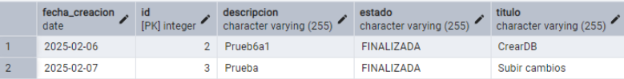
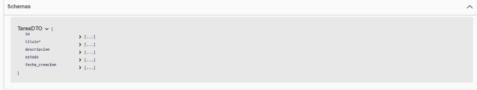
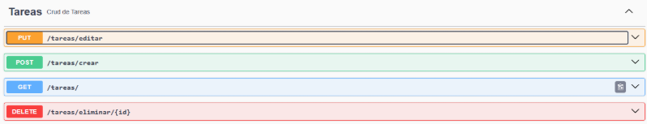
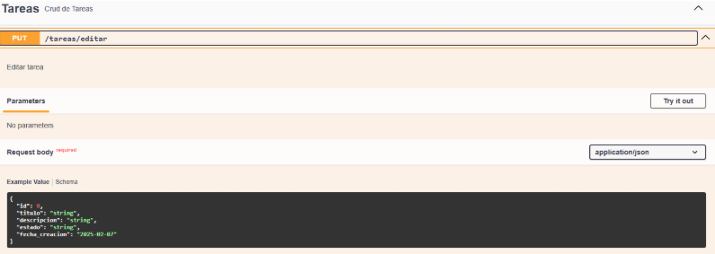
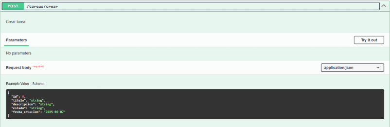
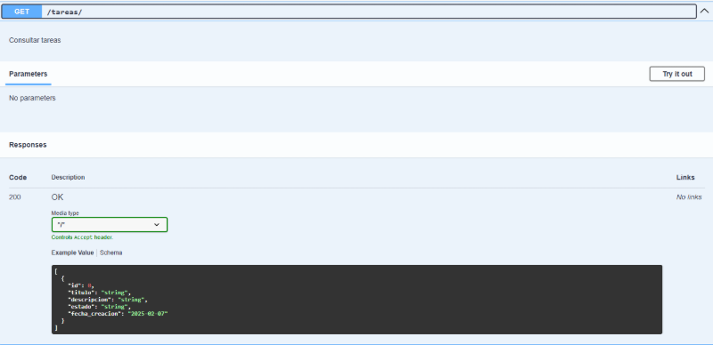
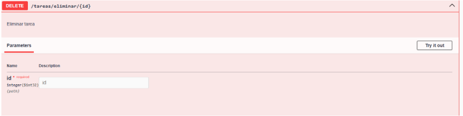
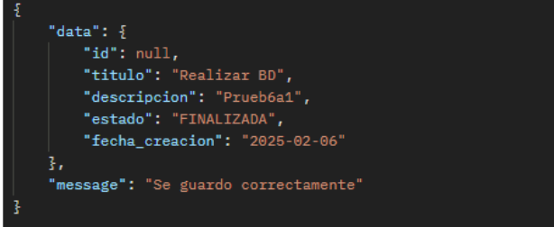
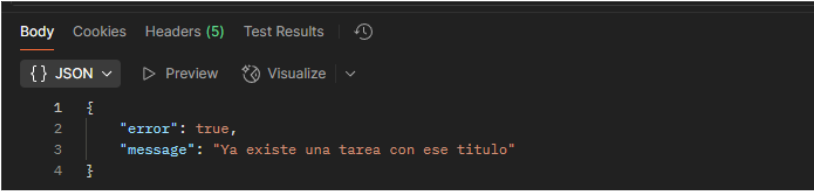
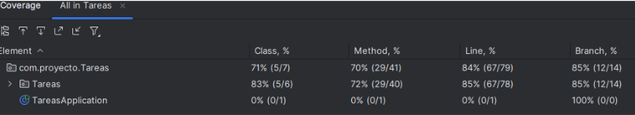

Descripción
Construye una API REST para gestionar un sistema de Tareas que permita a los usuarios realizar las siguientes operaciones:
Crear una nueva tarea.
Obtener una lista de todas las tareas.
Actualizar el estado de una tarea (pendiente/completada).
Eliminar una tarea por su ID.

SOLUCIÓN
1. Modelo de datos:

2. Endpoints:

3. Validaciones:
   

4. Tests:

